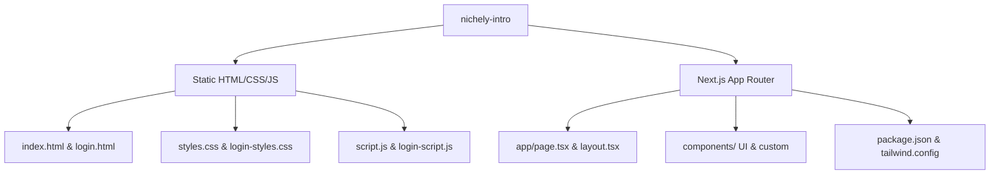
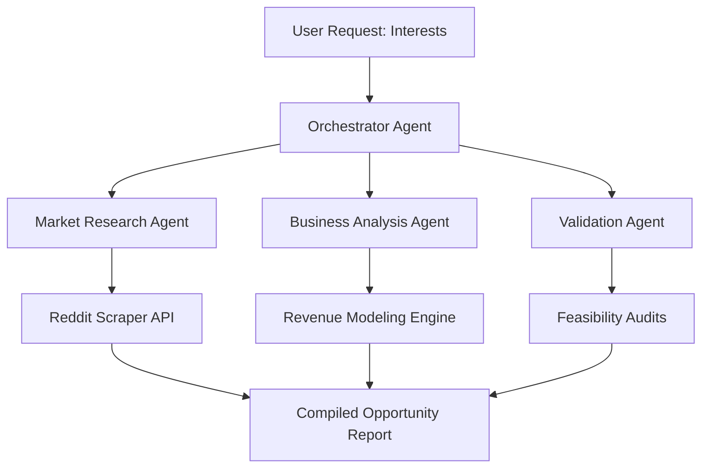

# Nichely - AI-Powered Niche Discovery & Startup Idea Generator

Nichely is an intelligent startup idea generator designed to discover and validate niche business opportunities. It combines high-fidelity, interactive user interfaces with a robust system blueprint for market intelligence, niche profitability scoring, and multi-agent orchestrations.

This repository hosts the **Nichely landing page and user onboarding experience**, structured in two implementation flavors: a lightweight static web deployment and a modern, modular React Next.js application.

---

## 📖 Project Overview

### Concept & Objective
Finding the right niche is one of the hardest parts of launching a startup. Nichely is designed to solve this by analyzing market trends, consumer pain points (using communities like Reddit), and business viability metrics. 

The primary objective of this project is to provide a complete, interactive, and responsive user experience outlining how Nichely works, displaying its features, and onboarding prospective users through a functional sign-in/sign-up wizard.

### Core Features
1. **Interactive Concept Presentation**: Interactive showcase of Nichely's core pillars: AI analysis, market intelligence, targeting precision, speed, competitor mapping, and profitability scoring.
2. **Dual-Mode Frontend**: 
   - **Static HTML/CSS/JS**: Run immediately in any browser with zero installations.
   - **Next.js Single Page App**: Component-driven React site ready to be scaled into a full SaaS platform.
3. **Onboarding Authentication Wizard**: Dual Sign-In and Sign-Up form panels featuring real-time client-side inputs verification, keyboard navigation accessibility, and custom loaders.
4. **Rich Visual Effects**: Built-in parallax hero background scrolling, page scrolling fade-in animations using the Intersection Observer API, and a custom CSS glassmorphism overlay.

### Technologies Used

#### Static Website Stack
*   **Structure**: HTML5 Semantic markup
*   **Styling**: Vanilla CSS (Custom properties, grid layouts, flexbox, CSS keyframe animations, backdrops)
*   **Logic**: Vanilla ES6 Javascript (Intersection Observers, input validation regex, event handlers)

#### Next.js React Stack
*   **Framework**: Next.js 14 (App Router)
*   **Language**: TypeScript
*   **Styling**: Tailwind CSS
*   **Components**: Radix UI primitives styled with shadcn/ui
*   **Icons**: Lucide React
*   **Environment**: Node.js & npm/pnpm

---

## 🏗️ Project Architecture

The application is structured to serve both static file hosting and modern Node-based execution environments side-by-side inside the `nichely-intro` workspace folder:



### Architectural Disclaimer
> [!IMPORTANT]
> This codebase represents a **high-fidelity frontend prototype and landing page mockup**. It is currently a client-side execution layout.
> - **Backend Service**: No active Python FastAPI backend is running inside this local folder.
> - **Database**: No SQL database connection is configured.
> - **AI Pipeline**: No local model weights or direct API inference connections are active in this project.
> 
> The system is architected to be expanded into these layers (see **Future Roadmap** below).

---

## 📂 Folder Structure

The root directory contains the overall project layout:

*   `README.md` — The document you are reading now.
*   `.gitignore` — Git configuration to exclude node modules, cache files, and OS noise.
*   `nichely-intro/` — Core folder housing the frontend codes.
    *   `app/` — Contains Next.js App Router entrypoints (`page.tsx` home page, `layout.tsx` root shell, and `globals.css` base styling).
    *   `components/` — Shared React components like `nichely-logo.tsx` and `feature-card.tsx`.
        *   `ui/` — Houses Radix UI primitive UI wrappers (e.g. Buttons, Cards, Inputs, Toasts) styled with Tailwind.
    *   `hooks/` — Custom hooks supporting device responsive width checks and toast display.
    *   `lib/` — Tailwind CSS merge utilities (`utils.ts`).
    *   `public/` — Vector images, logos, and placeholders used across the applications.
    *   `styles/` — Additional styling configurations.
    *   `index.html` — Static entrypoint for the main landing page.
    *   `login.html` — Static entrypoint for the user sign-in/sign-up page.
    *   `script.js` / `login-script.js` — Client logic for static HTML pages.
    *   `styles.css` / `login-styles.css` — Custom stylesheets for static HTML pages.
    *   `tsconfig.json` / `next.config.mjs` / `postcss.config.mjs` / `components.json` — Build and configuration files for React and Tailwind.
    *   `package.json` — Manifest defining workspace scripts and React/Tailwind/TypeScript dependency packages.

---

## ⚙️ Installation Guide

Choose one of the two modes below to run Nichely on your machine:

### Mode A: Static Site (Quickest, Zero Dependencies)
This mode requires no compiler or terminal commands.

#### macOS & Windows
1. Open the project folder on your system.
2. Locate the file: `nichely-intro/index.html`.
3. Double-click to open it directly in any modern browser (Chrome, Safari, Firefox, Edge).
4. Alternatively, if you have `npx` installed, serve it locally with:
   ```bash
   npx serve nichely-intro
   ```

---

### Mode B: Next.js React Web Application
This mode builds the full component-based web interface using Node.js.

### 💻 macOS Setup

#### 1. Prerequisites (via Homebrew)
If you do not have Homebrew, Node.js, or Git installed, open terminal and run:
```bash
# Install Homebrew (if missing)
/bin/bash -c "$(curl -fsSL https://raw.githubusercontent.com/Homebrew/install/HEAD/install.sh)"

# Install Node.js and Git
brew install node git
```

#### 2. Install Dependencies
Navigate into the application folder and install package packages:
```bash
cd nichely-intro
npm install
```

#### 3. Run Development Server
Start the local Next.js server:
```bash
npm run dev
```

#### 4. Access the App
Open your browser and navigate to:
[http://localhost:3000](http://localhost:3000)

---

### 💻 Windows Setup

#### 1. Prerequisites
- Download and run the [Node.js Installer](https://nodejs.org/en) (LTS version recommended).
- Download and install [Git for Windows](https://gitforwindows.org/).

#### 2. Install Dependencies
Open Command Prompt, PowerShell, or Git Bash, and navigate to the project directory:
```cmd
cd nichely-intro
npm install
```

#### 3. Run Development Server
```cmd
npm run dev
```

#### 4. Access the App
Open your browser and navigate to:
[http://localhost:3000](http://localhost:3000)

---

## 🔧 Configuration

### Environment Variables
For the client-side mockup, no environmental configurations are needed. However, when integrating backend operations, create a `.env.local` file in the `nichely-intro/` directory:

```env
# Envisioned Backend API URL (for production/development routing)
NEXT_PUBLIC_API_URL=http://localhost:8000

# API Keys (to be handled strictly on the backend layer)
# OPENAI_API_KEY=your-key-here
# REDDIT_CLIENT_ID=your-id-here
```

### Configuration Files
- `next.config.mjs` — Bypasses linting and type errors during build pipelines to speed up deployments, and sets unoptimized images configuration for static exports.
- `tsconfig.json` — Standard TypeScript configuration mapping imports using the `@/*` absolute paths alias.
- `components.json` — Configuration setting for shadcn/ui referencing directories, css variables, and Lucide icon bindings.

---

## 🚀 Usage Guide

Step-by-step walkthrough to test the user flows:

1. **Homepage Review**: 
   - Open Nichely (using either Static or Next.js mode).
   - Scroll down to review the transition animations on the **Features** and **How it Works** cards.
   - Verify responsive scaling by resizing the browser window to mobile width (the navigation bar collapses into a hamburger menu).
2. **Onboarding Interaction**:
   - Click the **Get Started** button in the header or the **Start Discovering** button in the Hero.
   - You will be redirected to the onboarding portal (`login.html`).
3. **Login / Signup Switch**:
   - Click between the **Sign In** and **Sign Up** tabs to see the smooth sliding animations.
4. **Form Verifications**:
   - Try submitting the forms empty to see instant CSS/JS boundary errors.
   - Fill in a valid email (e.g. `test@example.com`) and password (8+ characters) to submit the forms. You will see a "Signing In..." loader followed by a successful simulation popup.

---

## 🔌 API Endpoints (Envisioned Backend Blueprint)

To guide future backend development, the application is designed to communicate with a REST API exposing the following pathways:

| HTTP Method | Endpoint | Description | Payloads (JSON) |
| :--- | :--- | :--- | :--- |
| **POST** | `/api/v1/auth/register` | Create a new user account | `{ email, password, name }` |
| **POST** | `/api/v1/auth/login` | Authenticate user and issue tokens | `{ email, password }` |
| **POST** | `/api/v1/niche/generate` | Trigger the multi-agent generation pipeline | `{ interests: [] }` |
| **GET** | `/api/v1/niche/list` | List all saved niche reports | *None* |
| **GET** | `/api/v1/niche/:id` | Fetch specific detail opportunity analysis | *None* |
| **POST** | `/api/v1/niche/:id/validate` | Re-run validations against fresh market data | `{ strictness: "high" }` |

---

## 🧠 AI/ML Architecture (Envisioned Design)

Nichely's core value proposition rests on a **multi-agent orchestration framework** designed to compile market intelligence:



### The AI Agents Workflow
1. **OrchestratorAgent**: Parses user interests and spawns specialized sub-agents. Consolidates outputs into the final report.
2. **MarketResearchAgent**: Queries Reddit API endpoints for threads discussing user pain points, compiling keyword sentiment, density, and volume trends.
3. **BusinessAnalysisAgent**: Recommends business models, estimates pricing strategy, and drafts revenue streams.
4. **ValidationAgent**: Audits target ideas against technical constraints, regulatory challenges, and potential barrier-to-entry threats.

---

## 🛠️ Troubleshooting

### Next.js Run Port Conflict
*   **Issue**: Error: `listen EADDRINUSE: address already in use :::3000`.
*   **Solution**: Another application is using port 3000. Run the server on a custom port instead:
    ```bash
    npm run dev -- -p 3001
    ```

### Missing Node Modules Error
*   **Issue**: `Error: Cannot find module 'next'` or package imports are broken.
*   **Solution**: Re-run the installation routine:
    ```bash
    rm -rf node_modules .next package-lock.json
    npm install
    ```

---

## 🗺️ Future Improvements Roadmap

*   [ ] **FastAPI Integration**: Create the async Python API backend.
*   [ ] **Agentic Framework**: Implement the Multi-Agent orchestrations using LangGraph or AutoGen.
*   [ ] **Social Data Scraping**: Connect live Reddit API integrations with fallback datasets for resilient research.
*   [ ] **Interactive Data Charts**: Embed charting libraries (like recharts or Plotly) to visualize niche growth trends.
*   [ ] **User Database**: Implement database persistence layer for saving generated niche ideas.
